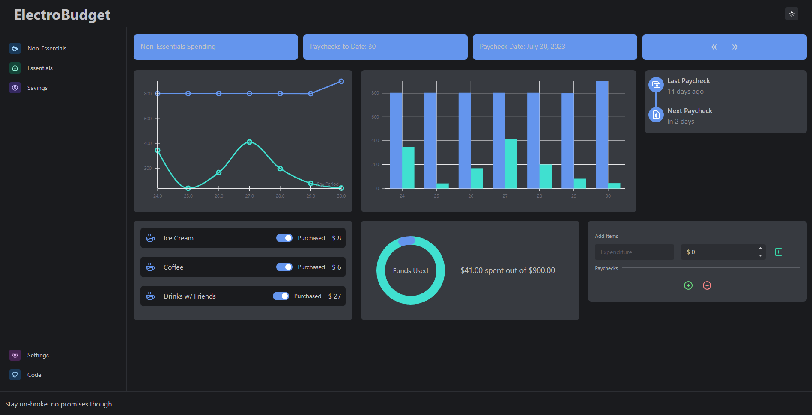

<div align="center">


</div>


## ElectroBudget
A budgetting app running on Electron. The intention is to let users keep track of money spent on essentials and non-essentials, as well as what's going into their savings accounts. Data is pulled from a JSON file so everything is kept local.  



## Usage
This project is intended to be used on a wide monitor. In the same folder as your project, there needs to be a folder called `Data` where a JSON file called `data.json` should be located. The JSON schema looks like
``` 
{
    "PaycheckNum": number,
    "Date": string, // In yyyy-mm-dd format
    "PaycheckAmount": number,
    "Allocations": Array[number, number, number], // Should add up to 1, order is [Essential %, NonEssential %, Savings %] in decimal format
    "ExpenseItems": Array[{
        "Type": string, // "Essential" or "NonEssential"
        "Name": string,
        "Cost": number,
        "Active": bool,
    }],
    "SavingsAccounts": Array[{
        "Account": string,
        "Type": string,
        "Goal": number,
        "CurrentValue": number,
    }]
}
```

## Available Scripts

In the project directory, you can run:

### `yarn electron:start`
Concurrently runs `yarn start` and `electron .`. 

